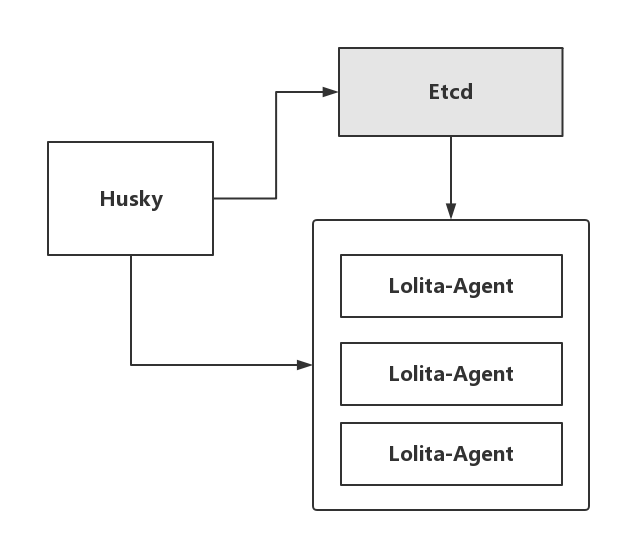

Hasky
======
Hasky基于Etcd的服务发现与故障恢复组件

本项目是作为[Lolita](https://github.com/domac/lolita)的附加扩展项目，提供以下功能

- 服务发现

    lolita agent启动的时候, 能被hasky感知并添加到监控任务

- 故障恢复

    lolita agent运行过程中出现故障, hasky会对它所在的组进行leader选举, 选出新的leader继续工作

- 服务开关

    添加lolita agent的运行开关,随时切换入口

- 作业注册

## 项目结构图

